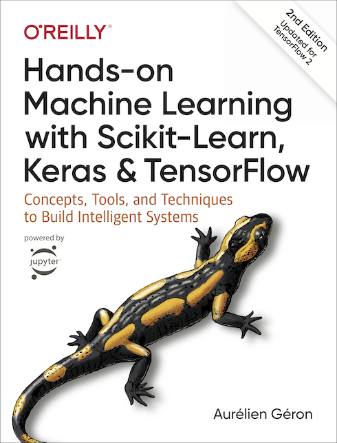
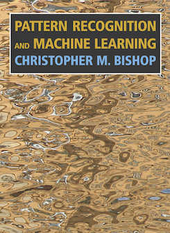

# Repositorio de la materia Aprendizaje Automático (UNSAM)

## 1er cuatrimestre de 2021

La materia se dicta en el marco del proyecto de Inteligencia Artificial Interdisciplinaria, como optativa de grado y de posgrado. Tiene una duración de 16 semanas, con una carga semanal de 6 horas (para un total de 96 horas). La materia empieza el 9 de marzo.

### Contenido de la materia

La materia presenta un panorama introductorio del mundo del análisis de datos y de las técnicas de aprendizaje automático. Se presentan conceptos fundamentales del análisis de datos (análisis exploratorio de datos, pre-procesado, etc.) y algunos de los modelos más frecuentemente usados (regresión lineal, regresión polinomial), así como un amplio panorama de las técnicas y algoritmos de aprendizaje automático, junto con algunos de los conceptos centrales del área (*overfitting*, *cross-validation*, etc.). Una parte importante de la cursada consta de ejercicios donde lo/as estudiantes ganan experiencia práctica directa en la implementación de algoritmos. Para ello, se requiere que lo/as estudiantes ejecuten código y lleven adelante ejercicios de manera independiente [(ver más abajo)](#sesiones-hands-on-y-código).

La materia se organiza en cuatro grandes módulos:

1. Introducción al análisis de datos e inferencia estadística.
2. Aprendizaje Automático.
3. Redes neuronales y aprendizaje profundo.
4. Temas adicionales.

A través de estos módulos, se avanza desde los fundamentos de las técnnicas, pasando por algoritmos de complejidad creciente, hasta la presentación de técnicas de vanguardia que se utilizan hoy en día en distintos ámbitos del conocimiento y comerciales, y que constituyen algunas de las áreas más activas del campo.

[Programa oficial de la materia](docs/Programa_ML.pdf)

### Horarios y modalidad

La materia se cursa los martes y jueves de 14h a 17h, a través de la plataforma Zoom (la conexión puede realizarse cliqueando [aquí](https://zoom.us/j/98381392066?pwd=TDRtQ3lpeDBLZ3VoUUU2T3paUjVNdz09)). Eventualmente, en caso de superar la capacidad de Zoom de 100 participantes, también transmitiremos la clase por otros medios. Las clases son sincrónicas, y las grabaciones solo estás disponibles de manera excepcional y a pedido para aquello/as que no hayan podido asistir a una clase. No es posible realizar la cursada de manera 100% asincrónica.

### Fechas de parciales

1er parcial: 29 de abril de 2021 -- 

### Docentes

* Rodrigo Díaz (profesor). [E-mail](mailto:rdiaz@unsam.edu.ar); [GitHub](https://github.com/exord); [Twitter](www.twitter.com/RDextrasolar); [LinkedIn](https://www.linkedin.com/in/rodrigofdiaz) (Para pedir puntos por la materia, puede ser que necesiten el [CV](docs/cv_RFDiaz_spa.pdf) del docente a cargo)
* Manuel Szewc (JTP). [E-mail](mailto:mszewc@unsam.edu.ar)
* Luis Agustín Nieto (ayudante). [E-mail](mailto:agustinnieto@gmail.com)

## Bibliografía

Muchos de los temas que vamos a abordar están presentados, de una manera u otra en los libros de Bishop and Géron

* [Hands-on Machine Learning with Scikit-Learn, Keras &  TensorFlow](https://www.amazon.com/Aur%C3%A9lien-G%C3%A9ron/dp/1492032646). O'Reilly Media; 2nd edition.

* [Pattern Recognition and Machine Learning](https://www.microsoft.com/en-us/research/publication/pattern-recognition-machine-learning/). Springer.

El libro de Bishop puede descargarse gratuitamente.

Además, recomendamos otras lecturas:
* Gregory, P. Bayesian Logical Data Analysis for the Physical Sciences.
* Jaynes, E.T. Probability Theory. The Logic of Science.
* Frodesen, A. G., Skjeggestad, O., y Tofte, H. Probability and statistics in Particle Physics.
 

### Sesiones hands-on y código

Las sesiones prácticas durante las clases requieren la ejecución de notebooks de Jupyter con python. Para esto existen dos opciones: o bien ejecutar el código de manera local, o hacerlo en un entorno de trabajo en la nube, [Google Colab](https://colab.research.google.com).

#### Local
En el primer caso, se requiere tener instalado [`Pyhon 3`](https://www.python.org/) y los siguientes paquetes:
* `numpy`
* `scipy`
* `matplotlib`
* `pandas`
* `scikit-learn`

Para los módulos 3 y 4, también será necesaria la instalación de `keras`con el backend `Tensorflow`. Una elección interesante es la distribución de [Anaconda](https://www.anaconda.com/products/individual)

Todos estos paquetes pueden instalrse fácilmente, una vez que `python` esté instalado, desde una terminal, a través de [`pip`](https://packaging.python.org/tutorials/installing-packages/#use-pip-for-installing) o `conda`.

#### Google Colab

Una posibilidad para no tener que instalar código localmente es usar la plataforma [Google Colab](https://colab.research.google.com). Acá hay unas [diapositivas](https://drive.google.com/file/d/1QfcxTrgpElsFVkpLeImfKnxc2EJzZg2J/view) con una corta introducción a Colab.

### Este repositorio

Los notebooks que forman parte del repositorio contienen las partes prácticas de las clases, tanto de los martes como de los jueves, y ejercicios. Vamos a ir subiendo los notebooks a medida que avancemos con las clases; siempre hay algo nuevo para agregar, y los estamos tweakeando todo el tiempo en función de las cosas que discutimos en clase. Por eso, no alcanza con que bajen el repo una sola vez. Lo más aconsejable es que clonen el repositorio (o lo [linkeen con Colab](https://drive.google.com/file/d/1QfcxTrgpElsFVkpLeImfKnxc2EJzZg2J/view)) y lo mantengan actualizado usando Git. 

Si no están familiarizados con Git, les proponemos que lean o vean algunos tutoriales online. Acá les dejamos [una opción](https://www.youtube.com/watch?t=139&v=PvB5VFqJz0M&feature=youtu.be).

#### Diapositivas de las clases

Las diapositivas estarán disponibles en el [Wiki](https://github.com/IAI-UNSAM/ML_UNSAM/wiki) del repositorio.

---
