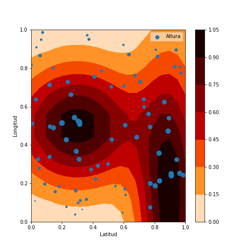
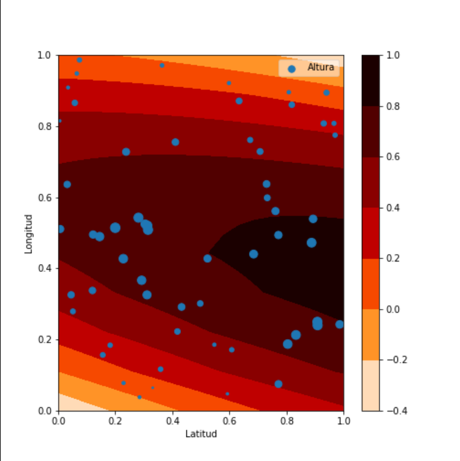
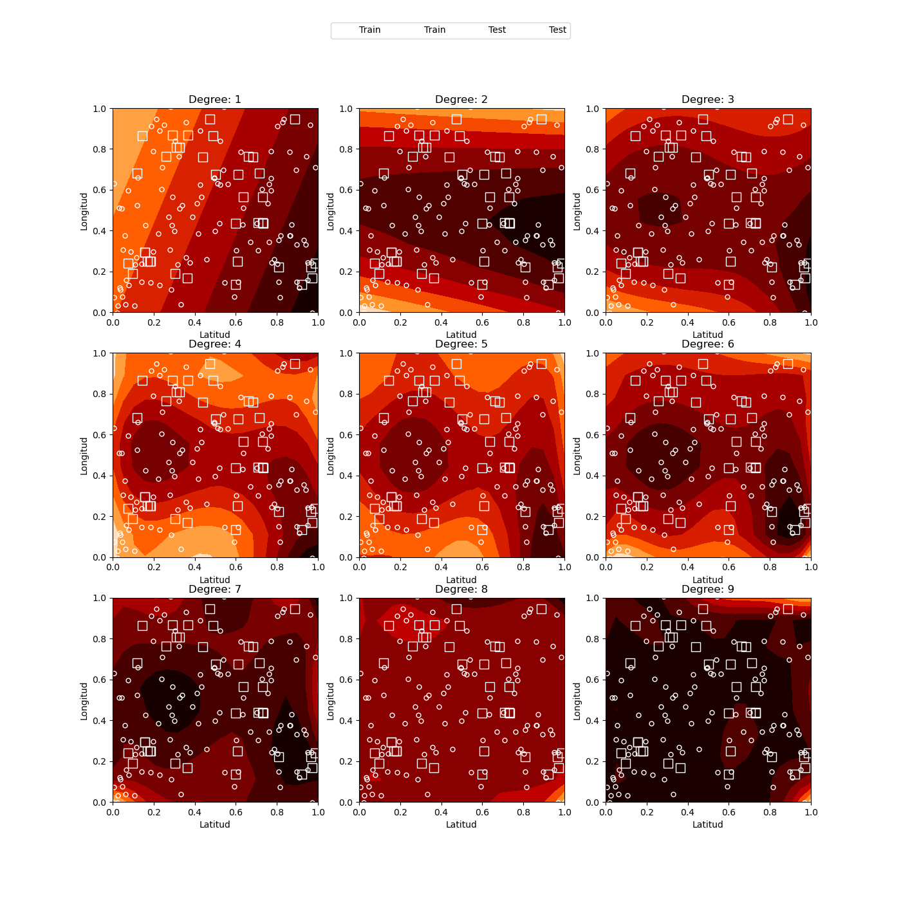
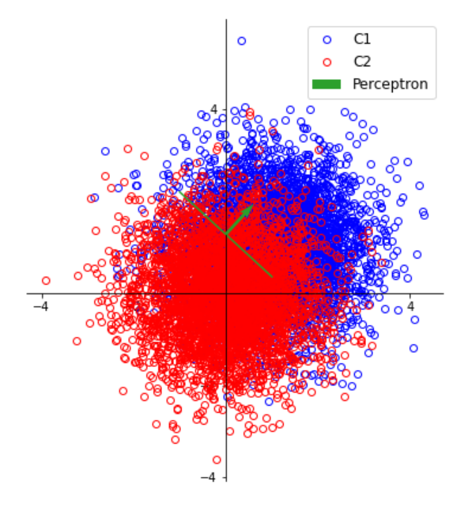
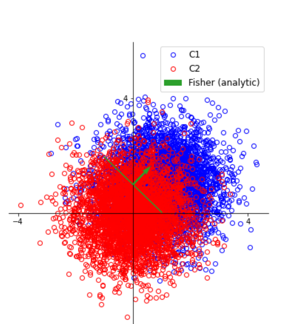
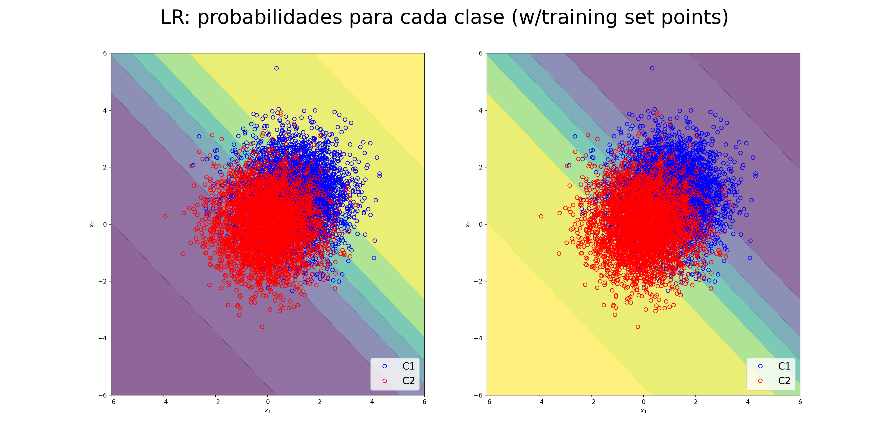
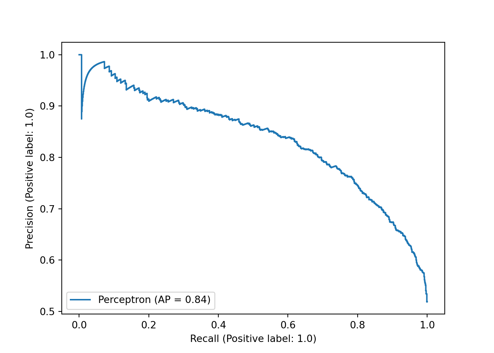
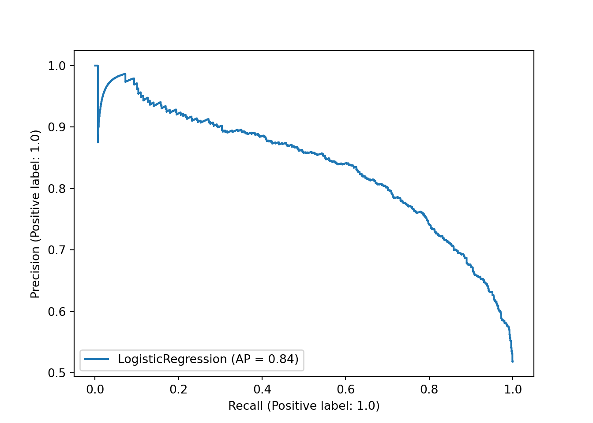

<!-- setup chunk -->

```{r setup, message=F}
knitr::opts_chunk$set(message = F)
knitr::opts_chunk$set(results = "hold")
# knitr::opts_knit$set(root.dir = here::here())
# knitr::opts_knit$set(root.dir = here::here("R"))
# library(utiles)

scale01 <- function(x, top=1, bot=0) {
  d <- (x - min(x)) / (max(x) - min(x))
  
  (d * top) + bot
}
ihs <- function(x) log(sqrt(x^2 + 1) +x)

knitr::opts_chunk$set(cache = F)
library(dplyr)
library(tidyr)
library(ggplot2)
# library(purrr)
# library(plotly)
# library(renv)
library(reticulate)

# los plot no se mostraban :shrug: y con esto funcionó:
# https://community.rstudio.com/t/how-to-display-the-plot-in-the-python-chunk/22039/3
# https://github.com/rstudio/rstudio/blob/8aed5680540999b68d493c583c84bc2790ce4aff/src/cpp/session/modules/SessionReticulate.R#L163
matplotlib <- reticulate::import("matplotlib")
matplotlib$use("Agg", force = TRUE)
```

# Convertir JSON a Rmd

Sé usar `graphics`, `ggplot2` y los notebooks de `rmarkdown` mucho mejor que `matplotlib` y _Jupyter_.

Espero sepan disculpar la molestia :)

```{r, eval=F}
# rmarkdown:::convert_ipynb(input = "P/parcial1_1_2021.ipynb", 
#                          output = "R/parcial1_1_2021.Rmd")
```

```
Detected the following probable line magics. They do not work in R Markdown.

  %matplotlib inline
```

> La conversión de ipynb a rmd se queja de esa línea, pero *en R no hace falta la magia*. (?)

# Primer parcial

Copio y pego del notebook convertido a Rmd.

Mis comentarios estarán en _quotes_:

>  Quotes como este :)

## Ejercicio 1: Probabilidad e Inferencia Bayesiana

Se cuenta con un proceso aleatorio del cual la única información que se tiene es que solo puede dar dos resultados: blanco (B) o negro (N).

> Hint: es binomial (?)

**a.** ¿Qué distribución de probabilidad podría usarse para describir el resultado de este experimento? Jusitifique brevemente. ¿Qué parámetro sería necesario inferir para tener un conocimiento acabado del proceso?

> Si las observaciones son iid, con una binomial alcanza: 0/negro & 1/blanco.
> 
> El parámetro de la binomial es "p", la probabilidad de observar un "éxito".

Para caracterizarlo se lleva a cabo un experimento en el que el proceso se realiza tres veces, y se obtiene tres veces blanco (es decir, [B, B, B]).

**b.** ¿Qué hipótesis tiene que incluir para poder describir este resultado con una función de distribución conocida? ¿De qué ley de probabilidad se trata?

> El supuesto es el de variables "iid":
> 
> Variables _independientes_ (la obs no depende de las anteriores) e _idénticamente distribuidas_ (todas son de la misma binomial).
> 
> La forma matemática de la independencia es:

$$p(A|B) = p(A) \cdot p(B)$$

**c. Máxima verosimilitud.** Calcule el estimador de máxima verosimilitud del parámetro principal que describe el proceso. Interprete el resultado.

> Analíticamente:

$$\mathcal{L}(\theta = p\,|\,x_1,\ldots,x_n) = \prod_{i=1}^n f(x_i|p)$$

> Para la binomial, la funcion de verosimilitud es:

$$ \mathcal{L} = p^x(1-p)^{n-x} $$

> Luego, pidiendo:

$$ \frac{\partial}{\partial p} \mathcal{L}(p\,|\,x_1,\ldots,x_n) = 0 $$

> Se puede despejar:

$$ p_{ML} = \frac{x}{n}$$

> Dado que n=3 y que todos los x son exitos:

$$ p_{ML} = \frac{3}{3} = 1$$

> Ahora numéricamente:

```{r}
# x <- -1:2
# d <- dbinom(size = 1, prob = 0.5, x = x)  # probability densities
# plot(y=d,x=x,main="p=0.5")
# 
# x <- -1:2
# d <- dbinom(size = 1, prob = 0.1, x = x)  # probability densities
# plot(y=d,x=x,main="p=0.1")

# q <- seq(-1, 2, by=0.1)
# d <- pbinom(size = 1, prob = 0.5, q = q)  # distribution function
# plot(y=d,x=q,main="P[X ≤ x]", type="p")
```

```{r}
observaciones <- c(1,1,1)
probs <- seq(0,1,length.out = 10000)

dbinom.lik <- Vectorize(function(prob){
    lik <- dbinom(size = length(observaciones),
                  prob = prob, 
                  x = sum(observaciones))
    
    return(lik)
  })

likes <- dbinom.lik(probs)

plot(x=probs, y=likes, type="l", 
     main = "p vs likelihood",
     xlab = "p", ylab = "L")
```

> El plot tiene sentido: si solo observo éxitos, lo más cercano a eso es p=1.
> 
> Pero no es inverosímil observar los datos si p<1 :)

**Inferencia bayesiana**. Se desea ahora realizar la inferencia bayesiana del parámetro en cuestión. En primer lugar, debe definirse un prior para este parámetro.

**d.** Elija un prior y justifique su elección. ¿Hay alguna forma de expresar este prior que resulte particularmente útil para simplificar el problema? Explique por qué.

> Como no sabemos nada sobre la distribucion del parametro, salvo que es de una Bernoulli, viene bien una distribucion uniforme entre 0 y 1.
>
> Es equivalente a una Beta con a=b=1, pero viene mejor la Beta para tener una solución analítica.
> 
> Eso es por que la Beta es la distribución prior "conjugada" de la verosimilitud de una Binomial/Bernoulli.

**e.** Usando un prior uniforme, obtenga de manera analítica la distribución posterior del parámetro. Grafíquela junto con el prior.

> Para la binomial, la funcion de verosimilitud es:

$$ \mathcal{L}=p^x(1-p)^{n-x} = p^3 (1-p)^0 = p^3$$

> Reemplazando:

$$ \mathcal{L} = p^3 (1-p)^0 = p^3$$

> Con un prior Beta (con x=p):

$$ P(p) = \frac{1}{B(\alpha,\beta)} p^{\alpha-1}(1-p)^{\beta-1} $$

> Con a=b=1 tengo:

$$ P(p) = \frac{1}{B(1,1)} p^{0}(1-p)^{0} = 1 $$

> La distribución posterior es:

$$ posterior \propto verosimilitud \cdot prior$$
> Luego:

$$ P(p|x) \propto p^3 \cdot 1$$

> En detalle:

$$ P(p|x) \propto p^x(1-p)^{n-x} \cdot \frac{1}{B(\alpha,\beta)} p^{\alpha-1}(1-p)^{\beta-1}$$

> Queda una expresión general:

$$ P(p|x) \propto (1-p)^{n+\beta-x-1} \ p^{x+\alpha-1} $$

> Otra expresión general:

$$ P(p|x) \propto Beta(x+\alpha, n+\beta-x)$$

> Donde pedimos para prior uniforme:

$$\alpha=1 \qquad \beta=1$$

> En nuestro caso queda:

$$ P(p|x) \propto Beta(4, 1)$$

> Es lo mismo que:

$$ P(p|x) \propto \frac{p^3}{B(4,1)} $$

> Un plot del prior vs "p":

```{r}
posterior <- function(p) p^3 * beta(4,1)

plot(posterior, from = 0, to = 1, type = "p",
     main = "Posterior distribution for 'p'", xlab = "p")
lines(x=probs, y=scale01(likes, top = 0.25), col= "red")
```

> Y da igual que la forma de la likelyhood.

> Leí:

* https://stats.stackexchange.com/questions/185221/binomial-uniform-prior-bayesian-statistics
* https://stats.stackexchange.com/questions/181035/how-to-derive-the-likelihood-function-for-binomial-distribution-for-parameter-es
* https://en.wikipedia.org/wiki/Binomial_distribution
* https://en.wikipedia.org/wiki/Bernoulli_distribution
* https://en.wikipedia.org/wiki/Beta_distribution
* https://en.wikipedia.org/wiki/Beta_function
* https://en.wikipedia.org/wiki/Conjugate_prior

----

**f.** Se recibe información de otro experimento equivalente realizado en otro laboratorio, que concluye que el parámetro de interés tiene un valor medio y un desvío estándar (es decir, la raíz de la varianza) de $0.5 \pm 0.1$. Exprese esta información a través del prior del problema usando la función de distribución Beta, y vuelva a obtener de manera analítica el posterior. Compárelo con el del punto anterior.

> La beta se puede caracterizar por media y desvío,
> 
> y derivar de ellos los shape parameters de la distribución:

```{r}
# https://stats.stackexchange.com/questions/12232/calculating-the-parameters-of-a-beta-distribution-using-the-mean-and-variance
estBetaParams <- function(mu, var) {
  a <- ((1 - mu) / var - 1 / mu) * mu ^ 2
  b <- a * (1 / mu - 1)
  return(c(a = a, b = b))
}

estBetaParams(mu = 0.5, var = 0.1^2)

probs = seq(0,1, length=100)
plot(probs, dbeta(probs, 12, 12), ylab="density", type ="l", col=4)
```

> Partiendo de:

$$ P(p|x) \propto p^{x+\alpha-1} \ (1-p)^{n+\beta-x-1} $$

> Reemplazando con nuestros _shapes_ obtenemos:

$$ P(p|x) \propto p^{3+12-1} \ (1-p)^{3+12-3-1} = p^{15-1} \ (1-p)^{12-1} $$
$$ P(p|x) = \frac{1}{B(15,12)} p^{15-1} \ (1-p)^{12-1}$$

> O sea que el posterior es una Beta tal que:

$$ p \sim Beta(15, 12)$$

> Ahora grafico el prior del labo en negro, y nuestra posterior en rojo:

```{r}
probs = seq(0,1, length=100)
plot(probs, dbeta(probs, 12, 12), ylab="density", type ="l", col="black", ylim = c(0,5),
     main = "Prior (black) vs. Posterior (red)")
lines(probs, dbeta(probs, 15, 12), ylab="density", type ="l", col="red")
```

> The power of strong prior beliefs (?)

**Ayuda:** las expresiones para la media y la varianza de una distribución Beta se pueden encontrar en el apéndice B del Bishop.

> Y en internet :P

**g. Posterior numérico**. Ahora, utilice un prior normal, con el mismo valor medio y desvío estándard que en el del punto anterior. Se pide obtener la distribución posterior con este nuevo prior de forma numérica, y graficarla junto con el prior.

$$ p_{prior} \sim \mathcal{N}(\mu=0.5, \sigma=0.1)$$

> La normal no es el _conjugate prior_ de una binomial :sadface:
>
> Hay que resolver esto:

$$ P(p|x) = \frac{p^3 \ \frac{1}{0.1 \sqrt{2\pi} } exp\left( -\frac{1}{2}\left(\frac{p-0.5}{0.1}\right)^2\right)}{P(x)}$$

> Antes habría que encontrar la distribución marginal de "x"

$$ P(x) ??$$

> Y para encontrarla me encantó leer: https://stats.stackexchange.com/a/3501
> 
> "But more to the point, we usually don't even care what P(cheese) is. Bear in mind, we are trying to hone our belief regarding whether or not an email is spam, and couldn't care less about the marginal distribution of the data"

> Por suerte en el notebook dice:
> 
> "Y la evidencia? Bueno, podemos calcularla numericamente"
> 
> Bishop mode on: "we can express the denominator in Bayes’ theorem in terms of the prior distribution and the likelihood function"

$$p(y)=\int p(y|\theta)p(\theta)\ d\theta \approx \sum_{j=1}^{m}\Delta_{j}p(y|\theta_{j})p(\theta_{j})$$

> Escrito para nuestro problema queda:

$$P(x) \approx \sum_{i=1}^{m}p(y|\theta_{i})\ p(\theta_{i}) \ \Delta\theta_{i}$$

```{r}
delta <- 0.0001
probs <- seq(0,1,by=delta)

likes <- dbinom.lik(probs)
# plot(likes)

prior <- dnorm(mean = 0.5, sd = 0.1, x = probs)
# plot(prior)

# evidence <- sum(likes * prior * delta)
evidence <- sum(exp(log(likes) + log(prior) + log(delta)))

evidence
```

$$ P(p|x) = \frac{p^3 \ \frac{1}{0.1 \sqrt{2\pi} } exp\left( -\frac{1}{2}\left(\frac{p-0.5}{0.1}\right)^2\right)}{0.1399997}$$

```{r}
posterior <- probs^3 * dnorm(mean = 0.5, sd = 0.1, x = probs) / evidence

plot(probs, prior, ylab="density", type ="l", col="black", ylim = c(0,5),
     main = "Normal prior (black), Numerical posterior (red), Beta posterior (blue)")
lines(probs, posterior, col="red")
lines(probs, dbeta(probs, 15, 12), ylab="density", type ="l", col="blue")
```

```{r}
# Acá hay un plot del posterior, y sampleos de "p" de ese posterior
# graficados encima como kernel density estimations

# plot(probs, posterior, col="red", type = "l", ylim = c(0,5),
#      main = "Posterior (red) and samples' kernel density estimations (gray, N=100)")
# 
# # Samplear 10 veces, 100 valores cada vez, y agregar el kernel density al plot anterior
# for(i in 1:10){
#   posterior.sample <- sample(x = probs, size = 100, prob = posterior*delta, replace = T)
#   lines(density(posterior.sample, from = 0, to = 1), col="grey")
# }
```

**Ayuda**: no olvide la normalización.

> :ok:

**h (optativo / por la gloria).** Usando la posterior del punto **e**, se busca realizar predicciones sobre futuras realizaciones del experimento: es decir, se quiere predecir el resultado de volver a realizar un conjunto de tres tiradas del experimento. 

> Challenge accepted! pero lo hago en R.

```{r}
# Posterior del ejercicio 1.e (normalizada)
posterior <- function(p) p^3 * beta(4,1) / (beta(4,1) * 1^4/4)
```

Desde el punto bayesiano, esto viene dado por la posterior predictiva, que puede pensarse como el _valor medio de la verosimilitud con respecto a la posterior_. Entonces, puede proceder de esta manera:

1. Obtenga muestras de la posterior del parámetro obtenida en el punto **e**. Para esto, puede usarse el método `rvs`de las clases de `scipy`.

```{r}
delta <- 0.0000002
probs <- seq(0,1,by=delta)

sum(posterior(probs)*delta)

posterior.samples <- list()

posterior.sample <- sample(x = probs, size = 1000, prob = posterior(probs)*delta, replace = T)

hist(posterior.sample)
```

2. Para cada muestra obtenida, calcule la verosimilitud para cada posible resultado del experimento (es decir, 0, 1, 2, o 3 éxitos). Acá se puede usar las facilidades de las clases del paquete `scipy.stats`, que permiten pasar un vector a los parámetros de las distribuciones.

```{r}
# No magic required:
log.likes <- sapply(posterior.sample, dbinom, size = 3, x = 0:3, log = T)

colnames(log.likes) <- posterior.sample
rownames(log.likes) <- 0:3

# A ver que hay dentro...
log.likes[,1:4] # cols=p samples, rows=number of success

# log.likes <- apply(log.likes, 2, function(X) exp(sum(X)))
```

3. Promedie los resultados sobre todos los valores de la posterior.

```{r}
posterior.predictiva <- apply(exp(log.likes), MARGIN = 1, FUN = mean)

sum(posterior.predictiva)
```

4. Grafique la PMF obtenida, que es la posterior predictiva.

```{r}
plot(x=0:3,
     y=posterior.predictiva, 
     xaxp=c(0,3,3),
     xlab="exitos", 
     ylim = c(0,max(posterior.predictiva)))
abline(h=1/length(0:3), col="grey")
```

Discuta el resultado obtenido en vistas de lo obtenido en el punto **c.**

> El punto "c" dijo:

```{r}
observaciones <- rep(1,3)
probs <- seq(0,1,length.out = 10000)

likes <- dbinom(x = sum(observaciones), 
                prob = probs,
                size = length(observaciones))

plot(x=probs, y=likes, type="l", 
     main = "p vs likelihood",
     xlab = "p", ylab = "L")
```

> O sea, no es inverosimil observar los datos para p<1 (ni para p<0.2)
> 
> Y se refleja en que la probabilidad posterior predictiva para x < 3 no es nula.
> 
> De hecho x = 0 es un resultado posible, pero x = 3 es el más favorecido.
> 
> Si N fuera más grande, y todos fueran éxitos, sería otra la cosa.
> 
> Ahora pruebo con 30 observaciones:

```{r}
observaciones <- rep(1,30)
probs1 <- seq(0,1,length.out = 10000)

likes <- dbinom(x = sum(observaciones), 
                prob = probs1,
                size = length(observaciones))

# Posterior del ejercicio 1.e (normalizada)
posterior <- function(p,n,x,beta=1,alpha=1) dbeta(x=p, x+alpha, n+beta-x)

delta <- 0.0000002
probs <- seq(0,1,by=delta)

post.probs <- posterior(p = probs, 
                        n = length(observaciones), 
                        x = sum(observaciones)) * delta
sum(post.probs)

posterior.samples <- list()

posterior.sample <- sample(x = probs, size = 1000, prob = post.probs, replace = T)

# No magic required:
log.likes <- sapply(posterior.sample, dbinom, size = 3, x = 0:3, log = T)

colnames(log.likes) <- posterior.sample
rownames(log.likes) <- 0:3

# log.likes[,1:4] # cols=p samples, rows=number of success

posterior.predictiva30 <- apply(exp(log.likes), 1, mean)

posterior.predictiva30
```


```{r}
plot(x=probs1, y=likes, type="l", 
     main = "p vs likelihood",
     xlab = "p", ylab = "L")

hist(posterior.sample, main="1000 muestras de la distribución posterior", xlab = "p")

plot(x=0:3,y=posterior.predictiva30, main = "posterior predictiva (rojo x=n=3, negro x=n=30)",
     xlab="exitos", pch=20,
     ylim = c(0,max(posterior.predictiva30)),
     xaxp = c(0,3,3))
points(x=0:3,posterior.predictiva, col="red")
# abline(h=1/length(0:3), col="grey")  # uniforme
```

> Y es otra la cosa.

****

## Python setup

> Python será!

```{r install_python_packages}
# reticulate::py_install("matplotlib")
# reticulate::py_install("numpy")
# reticulate::py_install("scikit-learn")
```

```{python pythonsetup, include=F}
import copy
import numpy as np
import matplotlib.pyplot as plt
from sklearn.preprocessing import PolynomialFeatures
from sklearn.metrics import mean_squared_error, confusion_matrix, roc_curve, accuracy_score
from sklearn.metrics import plot_precision_recall_curve
from sklearn.linear_model import LinearRegression, Ridge, Lasso, Perceptron, LogisticRegression
from sklearn.model_selection import cross_val_score, cross_val_predict, GridSearchCV, train_test_split
from sklearn.pipeline import Pipeline
import matplotlib as mpl
from utils import makew, plot_clasi  # de utils.py, un script del curso

np.random.seed(42)

print("hola python")
```

## Ejercicio 2: Regresión con modelos lineales

El objetivo consiste en caracterizar un mapa topográfico. El siguiente dataset consiste en tres columnas: latitud, longitud y altura sobre nível del mar. Para su fácil uso, se transformaron la latitud y longitud en dos coordenadas entre $[0.0,1.0)$ y la altura se paso a unidades apropiadas. El objetivo es interpolar esta superficie y tener $y=f(x_1,x_2)$.

```{python}
data = np.loadtxt('data/dataset_regresion.txt')
X=data[:,:2]
t=data[:,2]
```


```{python}
X[:10]
t[:10]
```

Por comodidad, le proveemos el verdadero mapa topográfico para que compare

```{python plot1, eval=F}
def tfunc(x1,x2):
  r1 = np.sqrt(((x1-0.3)/0.4)**2+((x2-0.5)/0.3)**2)
  print(r1.shape)
  r2 = np.sqrt(((x1-0.9)/0.2)**2+((x2-0.1)/0.7)**2)
  return np.exp(-r1**2)+np.exp(-r2**2)

x1=np.linspace(0.0,1.0,20)
x2=np.linspace(0.0,1.0,10)
z=tfunc(x1[np.newaxis,:],x2[:,np.newaxis])

plt.contourf(x1,x2,z,cmap='gist_heat_r')

plt.colorbar()

plt.scatter(X[:,0],X[:,1],s=100*t,label='Altura')

plt.legend(loc='upper right',framealpha=0.5)
plt.xlabel('Latitud')
plt.ylabel('Longitud')
```

```{r}

```


> Objetivo: modelar la altura

$$ z(x,y) $$

**a.** Divida en conjunto de entrenamiento y test (80-20) y trabaje únicamente con el conjunto de entrenamiento.

```{python}
x_train, x_test, t_train, t_test = train_test_split(X, t)
```

> A veRRRR...

```{r}
train = data.frame(py$x_train, X3=py$t_train)
test = data.frame(py$x_test, X3=py$t_test)

datos <- 
  bind_rows(train = train,
            test = test,
            .id = "dataset")

ggplot(datos) + 
  geom_point(aes(X1,X2,size=X3,color=dataset)) +
  ggtitle("Dataset: train y test")
```

**b.** Realice un ajuste con base polinomial de grado 2 a todo el conjunto de entrenamiento, grafique los valores predichos e imprima el error del ajuste.

```{python}
degree=2
modelo=Pipeline([
    ['poly', PolynomialFeatures(degree=degree, include_bias=True)],
    ['regressor', LinearRegression(fit_intercept=False)]
    ])

modelo.fit(x_train,t_train)

modelo['regressor'].coef_
modelo['regressor'].intercept_
```

Para graficar, utilice el siguiente código:

```{python plot2, eval=F}
x1=np.linspace(0.0,1.0,20)# grilla en latitud
x2=np.linspace(0.0,1.0,10)# grilla en longitud
X1, X2 = np.meshgrid(x1,x2)
elements = np.c_[X1.ravel(),X2.ravel()]# junto todas las combinaciones posibles de mi grilla
z=modelo.predict(elements).reshape(X1.shape)#aca va el modelo
plt.contourf(x1,x2,z,cmap='gist_heat_r')
plt.colorbar()
plt.scatter(x_train[:,0],x_train[:,1],s=100*t_train,label='Altura')
plt.legend(loc='upper right',framealpha=0.5)
plt.xlabel('Latitud')
plt.ylabel('Longitud')
```


```{r}

```


> Casi! :P

**c.** Encuentre el mejor grado de polinomio entre 1 y 10 para ajustar los datos utilizando los métodos vistos en la materia. Grafique la performance en función del grado y la predicción del mejor modelo.

```{python}
def polynomial_regressor(M):
    pr = Pipeline([
        ('poly_features', PolynomialFeatures(degree=M)),
        ('regressor', LinearRegression(fit_intercept=False) )])
    return pr

def compute_errors(model, x_train, y_train, x_test=None, y_test=None, print_result=True):
    """Compute and print MSE for trainng and, if given, test datasets."""
    training_error = mean_squared_error(y_train, model.predict(x_train))
    if print_result: print(f"The training mse is: {round(training_error,2)}")
    
    if x_test is not None and y_test is not None:
        test_error = mean_squared_error(y_test, model.predict(x_test))
        if print_result: print(f"The test mse is: {round(test_error,2)}")
        return training_error, test_error
    else:
        return training_error
    
degrees = range(1, 10)
train_errors = []
test_errors = []
models = []

for M in degrees:
    print(f"Polynomial degree: {M}")
    pr = polynomial_regressor(M)
    pr.fit(x_train, t_train)
    
    train_e, test_e = compute_errors(pr, x_train, t_train, x_test, t_test, print_result=True)
    
    train_errors.append(train_e)
    test_errors.append(test_e)
    models.append(pr)

```

> Perforrrrmance (MSE) en función del grado

```{r}
degrees <- 1:9
plot(degrees, unlist(py$train_errors), type = "l", ylab = "error (MSE)", xlab="degree", ylim = c(0,0.4))
lines(degrees, unlist(py$test_errors), col = "red")
```

> Basado en esto diría que el mejor grado es el "4"
> 
> Pero estaría contento con el 3 o el 5 también.

> Ahora más plots: train.t vs train.pred del train set.


```{python plot3, eval=F}
x1=np.linspace(0.0,1.0,20)# grilla en latitud
x2=np.linspace(0.0,1.0,10)# grilla en longitud
X1, X2 = np.meshgrid(x1,x2)
elements = np.c_[X1.ravel(),X2.ravel()]# junto todas las combinaciones posibles de mi grilla

# Perform multi-plot
ncolumns = 3

fig = plt.figure(figsize=(14, 14))

if len(models) % ncolumns == 0:
    extrarow = 0
else:
    extrarow = 1
        
axs = fig.subplots(ncols=ncolumns,
                   nrows=int(np.floor(len(models)/ncolumns) + extrarow))

x_ = np.linspace(0,1, 100).reshape(-1,1)
for i, ax in zip(range(len(models)), axs.flatten()):
    
    z=models[i].predict(elements).reshape(X1.shape)#aca va el modelo

    ax.contourf(x1,x2,z,cmap='gist_heat_r')
    # fig.colorbar(ax=ax)
    # ax.scatter(x_train[:,0],x_train[:,1],s=100*t_train,label='Altura')
    # ax.legend(loc='upper right',framealpha=0.5)
    ax.set_xlabel('Latitud')
    ax.set_ylabel('Longitud')

    ax.plot(x_train, t_train, '.', ms=10, mfc='None', label='Train', color= "white")
    ax.plot(x_test, t_test, 's', ms=10, mfc='None', label='Test', color= "white")
    
    ax.set_title('Degree: {}'.format(models[i]['poly_features'].degree))
    ax.set_ylim(0, 1)
    ax.set_xlim(0, 1)
    
# Make a single legend
handles, labels = ax.get_legend_handles_labels()
fig.legend(handles, labels, loc='upper center', ncol=len(handles), 
           fontsize=mpl.rc_params()['axes.labelsize'], borderaxespad=2.5)
           
fig.savefig("plot3.png")
```

```{r}

```


> La que más se parece al original es el de grado 5.

**d.** Incorpore ahora regularizacion Ridge y encuentre nuevamente el mejor polinomio. Grafique la predicción del mejor modelo. Compare los coeficientes del modelo elegido con los de un ajuste no regularizado, y comente el resultado.

> Pruebo varios lambdas desde ya para la segunda parte del enunciado.

```{python}
# 05_Regularization-BVtradeoff
def ridge(degree, lamb):
    return Pipeline([('poly_features', PolynomialFeatures(degree=degree)),
                     ('regressor', Ridge(alpha=lamb/2.0, fit_intercept=False))])

dftrain = []
dftest = []
coefs = []

lambdas = np.logspace(-5, 0, 100)
# [print(degree) for degree in degrees]
for lamb in lambdas:
  for degree in degrees:
    
    # ridge pipeline init
    rr = ridge(degree=degree, lamb=lamb)
    
    # Fit Ridge pipeline
    null = rr.fit(x_train, t_train)
    
    # Fit OLS
    ll = polynomial_regressor(M=degree)
    null = ll.fit(x_train, t_train)
    
    # Fit Lasso
    # ?
    
    # Predictions
    dftest.append({
      "x": x_test,
      "z": t_test,
      "z_ridge": rr.predict(x_test),
      "z_lin": ll.predict(x_test),
      "degree": degree,
      "lamb": lamb
    })
    dftrain.append({
      "x": x_train,
      "z": t_train,
      "z_ridge": rr.predict(x_train),
      "z_lin": ll.predict(x_train),
      "degree": degree,
      "lamb": lamb
    })
    
    # Coefficients
    coefs.append({ 
      "ridge": rr['regressor'].coef_,
      "OLS": ll['regressor'].coef_,
      "parameter": np.arange(1, len(rr['regressor'].coef_) + 1), 
      "degree": degree,
      "lamb": lamb
    })
```

> PolynomialFeatures genera los términos de interacción y no se pueden omitir.
> 
> En el último caso son 55 parámetros, es una locura.

```{python}
print(coefs[8]["OLS"].__len__())
```

```{r}
df.test <- py$dftest %>% lapply(as.data.frame) %>% bind_rows()
df.train <- py$dftrain %>% lapply(as.data.frame) %>% bind_rows()

df <- 
  bind_rows(test=df.test, 
            train=df.train, .id="group") %>% 
  pivot_longer(cols = c(z_ridge, z_lin), values_to = "pred", names_to = "regressor") %>% 
  mutate(group = factor(group, levels = c("train", "test"))) %>% 
  mutate(regressor = factor(regressor, levels = c("z_lin", "z_ridge")))

# Me quedo solo con un lambda para mirar
df <- df %>% filter(lamb == lamb[14401])

df
```


```{r}
df.mse <- df %>% group_by(degree, regressor, group) %>% 
  summarise(mse = mean(sqrt((z - pred)^2)))

ggplot(df.mse) + 
  geom_line(aes(x=degree, y=mse, group=group, color=group)) +
  facet_grid(~regressor)
```

> Mirando _solamente_ el training set, el mejor polinomio lineal (no regularizado) es el de grado 9.
> 
> Pero viendo el MSE del test set, es claro que está sobreajustando.
> 
> El mejor modelo lineal para el test set es el de grado 4 (y no está lejos del 5).

> En cambio, el MSE del método Ridge sobre el training set deja de disminuir a grado 7.
> 
> y el MSE del test set se plancha en el grado 5.
> 
> Dado que el polinomio de grado 7 minimiza el MSE sin aumentar el MSE del test, me quedaría con ese.
> 
> Usando regularización, cualquiera entre el 5 y el 7 parecería ir bien.

> Ahora hago un plotly para comparar OLS con Ridge.

```{r}
df.coefs <- py$coefs %>% lapply(as.data.frame) %>% bind_rows() %>% 
  pivot_longer(c(ridge, OLS), names_to = "regression", values_to = "w_values")

p1 <- df.coefs %>% ggplot(aes(x=lamb, y=ihs(w_values),
                        group=parameter, color=factor(parameter))) +
  geom_line() +
  facet_grid(regression~degree, scales = "free_y") +
  theme(legend.position = "none")

plotly::ggplotly(p1)
```

> Nota: w es constante en OLS porque no depende de lambda (justamente).
> 
> Los valores de los parametros de OLS crecen con cada incremento del grado en PolynomialFeatures.
> 
> Empiezan cerca de cero, y crecen hasta no ser menores a 5.

> En cambio, usando regularización Ridge los valores no crecen con el grado.
> 
> Curiosamente el parámetro 3 casi siempre queda alto, debe ser un buen parámetro! :P

**e.** Elija el mejor modelo y evalúelo en el conjunto de testeo. Además, prediga el valor de la altura para X = [1.1,0.5]. ¿Qué puede concluir?

> Elegí antes el modelo 7 de Ridge (y ya fue evaluado en el conjunto de testeo).
> 
> Grafico:

```{r}
df.mse2 <- df.mse %>% filter(degree == 7, regressor == "z_ridge")

p <- df %>% filter(degree == 7, regressor == "z_ridge") %>% 
  ggplot(aes(x=x.1, y=x.2, color=z)) + 
  # Z values as color in filled circles
  geom_point(shape=4) + 
  # empty circles coloured by "z-pred" (directional) and sized by abs(res)
  geom_point(aes(size=abs(z-pred), color=scale01(z-pred)), shape=1) +
  # mse annotation  
  geom_text(aes(x=0.5, y=-0.25, label=paste("MSE:", round(mse, 2))),
            color="black", size=2.5,
            data = df.mse2) +
  coord_fixed() + facet_grid(~group) +
  scale_color_gradient2(low = "red", high = "blue", mid = "black", midpoint = 0.5) +
  # scale_color_gradientn(colours = c("red", "red", "black", "blue", "blue"),
  #                       values = c(0, 0.875, 0.90, 0.99, 1),
  #                       limits = c(-18.2, 1.5),
  #                       guide = "colorbar")
  ggtitle("Test set evaluation", paste("lambda =", df$lamb[1]))

# podria hacer algo con rgb() pero ya fue
# plotly::ggplotly(p)
p
```

> Predicción en x=1.1, y=0.5

```{python}
lamb, degree = 0.001, 7

# Ridge pipeline init
rr = ridge(degree=degree, lamb=lamb)

# Fit Ridge pipeline
null = rr.fit(x_train, t_train)

# Fit OLS
ll = polynomial_regressor(M=degree)
null = ll.fit(x_train, t_train)

# Predictions
print("Ridge prediction")
rr.predict(np.array([[1.1,0.5],]))
print("\nOLS prediction")
ll.predict(np.array([[1.1,0.5],]))
```

> Ridge da altura negativa, pero no hay problema con eso a priori.
> 
> Muchas cosas están bajo el nivel del mar.
> 
> Pero si nos salimos un poco más...

```{python}
# Predictions
rr.predict(np.array([[2,0.5],]))
ll.predict(np.array([[2,0.5],]))
```

> Con polinomios pasan esas cosas.
> 
> Quizás se podría ajustar/elegir modelos restringiendo este comportamiento
> extremo, más allá de las fronteras de los datos de entrenamiento/testeo.

**f (optativo / por la gloria).** Utilice las siguientes funciones de base 

$$\{1, e^{-(\vec{r}-\vec{r}_{1})^2},e^{-(\vec{r}-\vec{r}_{2})^2}, e^{-(\vec{r}-\vec{r}_{3})^2}, e^{-(\vec{r}-\vec{r}_{4})^2}\}$$

con 

$$\vec{r}_{1}=(0.25, 0.25)^{T}$$

$$\vec{r}_{2}=(0.75, 0.25)^{T}$$

$$\vec{r}_{3}=(0.75, 0.25)^{T}$$

$$\vec{r}_{4}=(0.75, 0.75)^{T}$$

Utilizando los datos de entrenamiento, encuentre los parametros de máxima verosimilitud para este modelo utilizando Regresión Ridge y grafique el resultado.

> Challenge declined :(

****

## Ejercicio 3: Clasificación con modelos lineales

En el archivo `dataset_clasificacion.txt` se encuentran los datos a clasificar, en cada fila los dos primeros elementos son los datos y el último la clase a la que pertenece. 

**a.** Analice los datos, dimensiones, balance de clases, etc. Grafique con histogramas y/o plots.

```{python}
#a)
data = np.loadtxt('data/dataset_clasificacion.txt')
X=data[:,:2]
t=data[:,2]
#...
```

```{r}
datos <- py$data %>% as.data.frame()

# V3
cat("Dimension de los datos:\n")
dim(datos)
cat("\nTabla de frecuencias:")
table(datos$V3)

# V1 y V2
cat("\nResumen V1:\n")
summary(datos$V1)
cat("\nResumen V2:\n")
summary(datos$V2)
```

> 10000 observaciones de 3 variables
> 
> la tercera variable (la clase) está balanceada en dos clases: 0 y 1
>
> Las medias son similares, pero las medianas no tanto.

```{r}
ggplot(datos, aes(V1,V2, color=factor(V3))) + 
  geom_point(alpha=0.2, size=1) + 
  geom_density_2d() +
  theme_minimal() + coord_fixed()

datos %>% pivot_longer(-V3) %>% 
  ggplot(aes(value)) + 
  geom_histogram(aes(fill=factor(V3)), position = "identity", alpha = 0.5) + 
  theme_minimal()
```

> Son dos gausianas superpuestas en el plano V1/V2
> 
> V1 y V2 parecen ser independientes dentro de cada clase (es super redondita la distribucion).

**b1.** Utilice un regresor logístico y un perceptrón para clasificar el conjunto de datos usando el 80% para entrenamiento y el 20% para testeo.

> A la orden!

```{python}
#b1)
np.random.seed(42)
x_train, x_test, t_train, t_test = train_test_split(X, t, test_size=0.2)
```


```{python}
# 07_Clasificacion.ipynb
perce = Perceptron(max_iter=1000, random_state=50)

# En ese caso, la matriz de diseño es simplemente "x"
# Phi_train = x_train.copy()
# Phi_train = x_train.copy()
# phi = X.copy()

# perce = perce.fit(Phi_train, t_train)
perce = perce.fit(x_train, t_train)
# perce = perce.fit(Phi, t)

w_perce = makew(perce)
```


```{python}
print("\nCoeficientes (w1,w2):")
print(perce.coef_)

print("\nIntercept (w0):")
print(perce.intercept_)

print("\nVectorcito con todo:")
print(w_perce)
```


```{python plot4, eval=F}
# plot_clasi(x=X, t=t, ws=[w_perce[1:]], labels=['Perceptron'], thr=[-w_perce[0]] )
plot_clasi(x=x_train, t=t_train, ws=[w_perce[1:]], labels=['Perceptron'], thr=[-w_perce[0]] )

# C1 es 1, y C2 es 0:
# En plot_clasi "xc1" es "C1" y se asigna a max(t). O sea, "C1" es 1.
# En plot_clasi "xc2" es "C2" y se asigna a min(t). O sea, "C1" es 0.
```

```{r}

```


> Probé varios valores de random state hasta que me pareció que daba algo razonable.
> 
> Había de todo...

----

> BONUS (NO SOLICITADO)
> 
> En el curso se dijo:
> 
> "Seamos malvados y sometamos al algoritmo a una situación que no puede resolver."
>
> Esperaría que aunque sea diera más o menos bien, pero solo cambiando el seed se ve que no converge.
> 
> Esa idea de que la convergencia del perceptron no está asegurada en problemas no separables linealmente
> debe estar aplicando fuerte con este dataset (que es claramente no separable).
> 
> Por las dudas copié/adapté el código del discriminante de fisher analítico,
> que da más bonito (o aunque sea es consistente) para ver qué daba:

```{python}
# En el perceptrón C1 es 1, y C2 es 0:
xc1 = x_train[t_train == 1,:].T
xc2 = x_train[t_train == 0,:].T

m1_ = xc1.mean(axis=1).reshape(-1, 1)
m2_ = xc2.mean(axis=1).reshape(-1, 1)

print(m1_)
print(m2_)
```


```{python}
dm = m1_ - m2_

S1 = np.dot(xc1 - m1_, (xc1 - m1_).T)
S2 = np.dot(xc2 - m2_, (xc2 - m2_).T)

# Matrix de covarianza intra-clase
Si = S1 + S2

# Encuentro omega resolviendo la ecuación
w_fischer_a = np.linalg.solve(Si, dm)

# normalizo
w_fischer_a /= np.sqrt(np.dot(w_fischer_a.T, w_fischer_a))

# Ver notas abajo
umbral = np.dot(w_fischer_a.flatten(), 0.5 * (m1_.flatten() + m2_.flatten()))
```


```{python plot5, eval=F}
plot_clasi(x_train, t_train, [w_fischer_a], thr=[umbral], labels=['Fisher (analytic)'])
```

```{r}

```

> Y dá re lindo.
>
> Nota: no encontré en los notebooks como calcular el "umbral" a partir de "w"
> 
> Para calcularlo (como midpoint de proyeccion de las medias) leí:
> 
> https://stats.stackexchange.com/questions/4942/threshold-for-fisher-linear-classifier
> 
> https://en.wikipedia.org/wiki/Linear_discriminant_analysis#Fisher's_linear_discriminant
> 
> https://rstudio-pubs-static.s3.amazonaws.com/35817_2552e05f1d4e4db8ba87b334101a43da.html

----

> Regresión logística (sin regularización/penalty).
> 
> Obs: Lasso es "L1" y Ridge es "L2".

```{python}
# 08p_RegresionLogistica

# matriz de diseño
# Phi=np.hstack([np.ones(len(X)).reshape(-1,1),X])
Phi = np.hstack([np.ones(len(x_train)).reshape(-1,1),x_train])
Phi_test = np.hstack([np.ones(len(x_test)).reshape(-1,1),x_test])

lr = LogisticRegression(penalty='none',fit_intercept=False,tol=0.00000000001)

# lr.fit(Phi,t.ravel())
lr.fit(Phi,t_train.ravel())

# Coeficientes del modelo
# print(lr.coef_)
```

> Un lindo plot de los notebooks, para visualizar el resultado del ajuste.

```{python, eval=F}
# 08p_RegresionLogistica
x1=np.linspace(-6.0, 6.0, 100)
x2=np.linspace(-6.0, 6.0, 100)
X1toplot, X2toplot = np.meshgrid(x1,x2)

# use the "for" Luke...
Z1=(np.asarray([lr.predict_proba(np.asarray([1.0,el[0],el[1]]).reshape(1,-1))[0,1] for el in np.c_[X1toplot.ravel(), X2toplot.ravel()]])).reshape(X1toplot.shape)
Z2=(np.asarray([lr.predict_proba(np.asarray([1.0,el[0],el[1]]).reshape(1,-1))[0,0] for el in np.c_[X1toplot.ravel(), X2toplot.ravel()]])).reshape(X1toplot.shape)
```


```{python plot6, eval=F}
# 08p_RegresionLogistica
fig = plt.figure(figsize=(20, 10))
ax = fig.add_subplot(121)

ax.plot(*xc1, 'ob', mfc='None', label='C1')
ax.plot(*xc2, 'or', mfc='None', label='C2')
contour = ax.contourf(X1toplot,X2toplot,Z1,levels=[0.0,0.001,0.1,0.3,0.5,0.7,0.9,0.999,1.0],alpha=0.6)
#plt.colorbar(contour,ax=ax)

ax.set_xlabel('$x_1$')
ax.set_ylabel('$x_2$')
ax.legend(loc='lower right', fontsize=16)
# ax.set_aspect('equal')
ax = fig.add_subplot(122)

ax.plot(*xc1, 'ob', mfc='None', label='C1')
ax.plot(*xc2, 'or', mfc='None', label='C2')
contour = ax.contourf(X1toplot,X2toplot,Z2,levels=[0.0,0.001,0.1,0.3,0.5,0.7,0.9,0.999,1.0],alpha=0.6)
#plt.colorbar(contour,ax=ax)

ax.set_xlabel('$x_1$')
ax.set_ylabel('$x_2$')
ax.legend(loc='lower right', fontsize=16)
# ax.set_aspect('equal')

fig.suptitle('LR: probabilidades para cada clase (w/training set points)', fontsize=32)
```

```{r}

```


> Ahora, el accuracy (calculado a partir del test set).
>
> O sea: (TP + TN) / (todo)
> 
> https://towardsdatascience.com/understanding-data-science-classification-metrics-in-scikit-learn-in-python-3bc336865019

```{python}
# 08p_RegresionLogistica

# Accuracy: "the fraction of correctly classified samples"
acc_lr = accuracy_score(t_test.ravel(), lr.predict(Phi_test))
print("\nLogistic regression accuracy: " + str(acc_lr))
# print(accuracy_score(t.ravel(),lr.predict(Phi)))

acc_perce = accuracy_score(t_test.ravel(), perce.predict(x_test))
print("\nPerceptron accuracy: " + str(acc_perce))
```


> El regresor logístico le gana al perceptrón (a _este_ perceptrón), por ~4%.
> 
> Dado que a ojo estaban bastante superpuestas, 0.75 no está tan mal (imho).

**b2.**Compare ambas implementaciones y explique cuál considera una mejor solución justificando mediante el uso de matrices de confusión y curvas PR/ROC.

> Consigo las predicciones, probabilidades de clase, y valores de TPR y FRP de la regresión logistica.

```{python}
#b2)
# Predicciones logi
y_pred_logi = lr.predict(Phi_test)
logi_confusion_matrix=confusion_matrix(t_test, y_pred_logi)

# ROC del logi
y_pred_logi_probas = lr.predict_proba(Phi_test) # tomo la segunda columna como "exito"
logi_fpr, logi_tpr, logi_thresholds = roc_curve(t_test, y_pred_logi_probas[:,1])
# logi_fpr, logi_tpr, logi_thresholds = roc_curve(t_test, y_pred_logi)
```

> Consigo las predicciones, y valores de TPR y FRP del perceptrón (con el "w0" original).
> 
> Para obtener muchos TPR/FPR itero sobre valores de "w0".
> 
> Eso desplaza la frontera de decision en la dirección que mejor separa a los datos.
> 
> Podría haber hecho otra cosa, pero se parece a lo que haría con la logística.

```{python}
# Predicciones perce
y_pred_perce = perce.predict(x_test)
perce_confusion_matrix = confusion_matrix(t_test, y_pred_perce)

# ROC perce (quizas podria variar el umbral)
# y_pred_logi_perece = perce.predict_proba(x_test)
# perce_fpr, perce_tpr, perce_thresholds = roc_curve(t_test, y_pred_perce)
# perce_fpr, perce_tpr, perce_thresholds = roc_curve(t_test, y_pred_logi_perece)
perce2 = copy.copy(perce)

perce_fprs = []
perce_tprs = []

# Pruebo umbrales varios
umbrales = np.arange(-6, 6, 0.1)

for umbral in umbrales:
  # Reemplazo el intercept
  perce2.intercept_ = umbral
  y_pred_perce2 = perce2.predict(x_test)
  # Calculo FPR y TPR con el nuevo intercept
  perce_fpr, perce_tpr, perce_thresholds = roc_curve(t_test, y_pred_perce2)
  # Y me los guardo
  perce_fprs.append(perce_fpr)
  perce_tprs.append(perce_tpr)
```

> Matrices de confusión para el perceptrón y la regresión logística.

```{r}
cat("Test set:\n")
summary(factor(py$t_test))

cat("\nLogistic Regression Confusion Matrix\n")
logi.table <- table(factor(py$t_test), factor(py$y_pred_logi))
addmargins(logi.table, FUN = list(Total = sum), quiet = T)

cat("\nPerceptron Regression Confusion Matrix\n")
perce.table <- table(factor(py$t_test), factor(py$y_pred_perce))
addmargins(perce.table, FUN = list(Total = sum), quiet = T)

# Con proporciones:
# addmargins(prop.table(logi.table), FUN = list(Total = sum), quiet = T) %>% round(digits = 2)
# addmargins(prop.table(perce.table), FUN = list(Total = sum), quiet = T) %>% round(digits = 2)
```

> Para mi gana el regresor logístico, que se equivoca por igual en ambas clases.
> 
> El perceptrón es inestable, cada vez que cambio el random state o el seed sale otra cosa.
> 
> En _este_ perceptrón, hay un bias hacia el "0".
> 
> Eso hace que le pegue más al 0 (0.82 TPR) que al 1 (0.69 TPR); no es que sea mejor clasificando.

> ROCs

```{r}
perce_fprs <- unlist(py$perce_fprs)
perce_tprs <- unlist(py$perce_tprs)

roc.df <- 
  data.frame(
    fpr = c(py$logi_fpr, perce_fprs),
    tpr = c(py$logi_tpr, perce_tprs),
    regressor = rep(c("logi", "perce"), times=c(length(py$logi_fpr), length(perce_fprs)))
  )

ggplot(roc.df, aes(x=fpr,y=tpr)) +
  geom_segment(aes(x=0,y=0,xend=1,yend=1), linetype = 2) +
  geom_line(aes(color=regressor)) + geom_point(aes(color=regressor)) +
  theme_minimal() + ggtitle("ROC curves") + coord_fixed()
```

> En esto se ve que la dirección de _este_ perceptrón estaba bien.
> 
> Lo que había elegido "mal" fue el bias ("w0").
> 
> La curva ROC es esencialmente igual a la del regresor logístico.

```{python plot7, eval=T, include=T}
pr_curve_pt = plot_precision_recall_curve(X=x_test, y=t_test, estimator=perce)

pr_data_perce = pr_curve_pt.line_.get_xydata()
```


```{python plot8, eval=T, include=T}
pr_curve_lr = plot_precision_recall_curve(X=Phi_test, y=t_test, estimator=lr)

pr_data_logis = pr_curve_lr.line_.get_xydata()
```

```{r}

```


```{r}

```


> Una vez más, _muy_ similares.

**c.** Grafique la frontera de decisión del perceptrón sobre el conjunto de datos.

> Hecho arriba!

**d.** Para cada uno de estos requisitos, justifique si alguno de sus modelos pueden cumplirlo:

1.  "Quiero encontrar al menos el 80% de los positivos de la muestra y estar seguro que al menos el 90% de mis detecciones positivas son correctas."
2.  "Quiero que al menos el 95% de mis detecciones positvas sean correctas."

> El primer punto es calcular la "fracción de los positivos reales que clasifico como positivos": TP / (TP + FN) > 0.8
> 
> y calcular la "fracción de las clasificacines positivas que son correctas": TP / (TP + FP) > 0.9
> 
> Son la "sensibilidad" (sensitivity/recall) y la "precisión" (precision), respectivamente.
> 
> El segundo punto también es calcular la sensibilidad (>= 0.95).

```
Sensitivity = TP / (TP + FN) = TPR = 1 - FNR > 0.8
  recall_score > 0.8
Precision   = TP / (TP + FP) = PPV = 1 - FDR > 0.9
  precision_score > 0.9
```

> Estas cosas dependen del umbral: hay que ver si para algún umbral se satisface la condición del enunciado.
> 
> La idea es buscar ese punto en el PR curve.

```{r}
as.data.frame(py$pr_data_perce) %>% 
  dplyr::rename(recall_score = V1, precision_score = V2) %>% 
  mutate(condition = recall_score >= 0.8 & precision_score >= 0.9) %>% 
  with(condition) %>% any()

as.data.frame(py$pr_data_logis) %>% 
  dplyr::rename(recall_score = V1, precision_score = V2) %>% 
  mutate(condition = recall_score >= 0.8 & precision_score >= 0.9) %>% 
  with(condition) %>% any()
```

> Y resulta que no, no se puede cumplir la condición del enunciado 3.d.1 para ningún modelo.

```{r}
as.data.frame(py$pr_data_perce) %>% 
  dplyr::rename(recall_score = V1, precision_score = V2) %>% 
  mutate(condition = recall_score >= 0.95) %>% 
  with(condition) %>% any()

as.data.frame(py$pr_data_logis) %>% 
  dplyr::rename(recall_score = V1, precision_score = V2) %>% 
  mutate(condition = recall_score >= 0.95) %>% 
  with(condition) %>% any()
```

> Pero cualquier modelo puede cumplir con que más del 95% de sus detecciones positivas sean correctas.
> 
> El perceptrón podría haber fallado en esta si el "w" hubiera quedado en direccion perpendicular a la esperada.

**e.** Responda cuál o cuáles de los modelos, tal cual los entrenó, pueden responder a la siguiente pregunta: 

"¿Qué puntos del conjunto de testeo tiene una probabilidad mayor a 90% de pertenecer a la clase 1?"

1.   Perceptrón.
2.   Regresión logística.
3.   Perceptrón y Regresión logística.

Justifique.

> Rta: 2
> 
> La regresión logística se basa en modelar las probabilidades de pertenecer a cada clase,
> 
> y se sacan directamente de predict_proba (como ya hice arriba).
> 
> El perceptrón *no* es un modelo probabilístico, solo encuentra una frontera de decisión por SGD.


